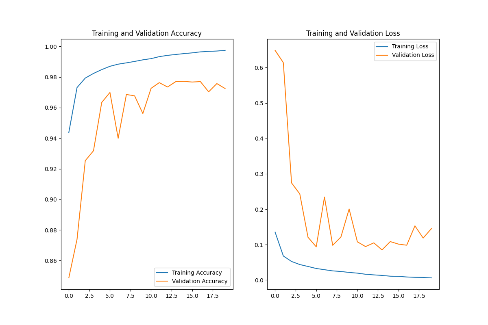
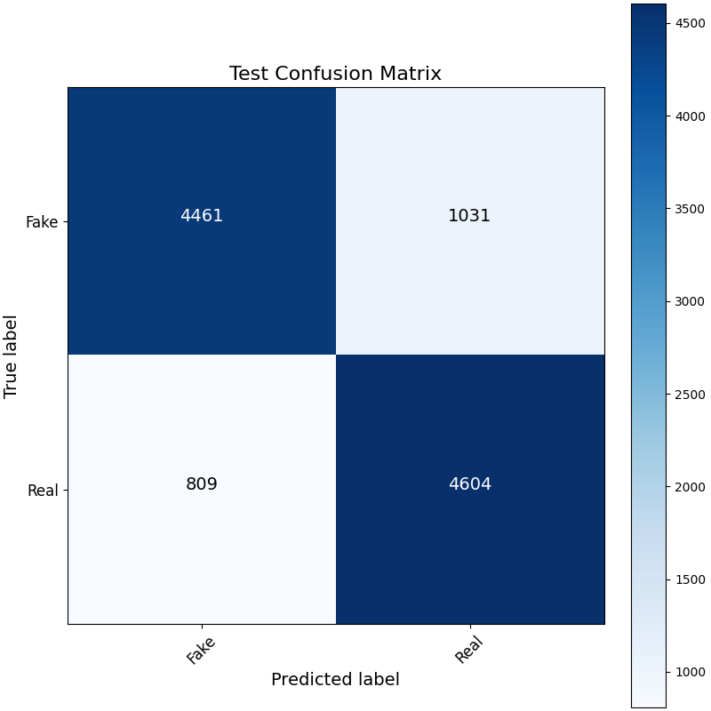
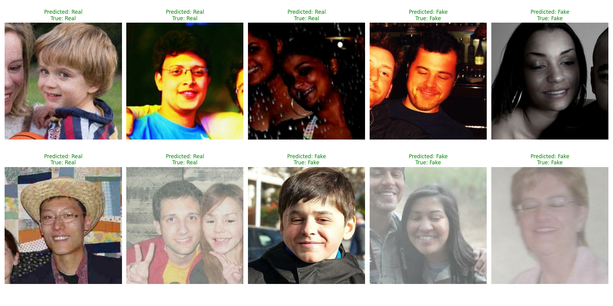

# DeepFake Detection Project

This project aims to build a deep learning model capable of detecting deepfake videos/images. The model leverages MobileNetV2 as a base, trained using TensorFlow and Keras. The project includes functionalities for training, evaluating, and testing the model, as well as data augmentation and class imbalance handling. Below, you will find an overview of the project's setup, requirements, and key features.

## Table of Contents
- [Project Structure](#project-structure)
- [Requirements](#requirements)
- [Usage](#usage)
  - [Data Preparation](#data-preparation)
  - [Training the Model](#training-the-model)
  - [Evaluating the Model](#evaluating-the-model)
  - [Testing the Model](#testing-the-model)
- [Results](#results)

## Project Structure
The directory structure of the project is as follows:

```
├── train.py                   # Main script to train the model
├── test.py                    # Script to test and evaluate the model
├── model.py                   # Contains the model definition
├── data_loader.py             # Loads and processes the dataset
├── config.py                  # Configuration file for various parameters
├── utils.py                   # Utility functions (e.g., check image integrity)
├── images/                    # Directory containing result images
│   ├── Confusion_Matrix.png
│   ├── Example_Predictions.png
│   └── Training_Accuracy_Loss.png
└── data/                      # Directory containing the dataset
    ├── Train/
        ├── Real/
        └── Fake/
    ├── Validation/
        ├── Real/
        └── Fake/
    └── Test/
        ├── Real/
        └── Fake/
```

## Requirements
To run this project, you need to have the following dependencies installed:

- Python 3.8+
- TensorFlow 2.6+
- NumPy
- scikit-learn
- Pillow
- Matplotlib

You can install the dependencies by running the following command:
```bash
pip install -r requirements.txt
```

## Usage
### Data Preparation
The dataset must be organized into three subdirectories:

- `data/Train`: Training data, organized into subfolders `Real` and `Fake`
- `data/Validation`: Validation data, also organized into `Real` and `Fake`
- `data/Test`: Test data, organized similarly

If there are corrupted images, you can run the utility function to check them:

```bash
python utils.py
```
This script will identify any corrupted images in the dataset and report them for removal.

### Training the Model
To train the model, simply run the following command:
```bash
python train.py
```
This script will perform the following:
- Load and preprocess the dataset
- Build the deep learning model using MobileNetV2 as the base
- Train the model, using class weights to handle class imbalance
- Save training accuracy and loss plots to the `images/` directory
- Save the best-performing model in the specified directory (`model backup/`)

The model training results will be saved as images under `images/Training_Accuracy_Loss.png`.

### Evaluating the Model
After training, the model can be evaluated using the validation dataset to generate metrics like the confusion matrix and classification report:

```bash
python test.py
```
The script performs predictions on the validation dataset and saves the resulting confusion matrix to `images/Confusion_Matrix.png`.

### Testing the Model
You can modify the `test.py` script to perform inference on new test data. It loads the trained model and computes metrics on the `data/Test` set.

## Results
The results of the model are visualized below:

1. **Training Accuracy and Loss**:

   

2. **Confusion Matrix**:

   

3. **Example Predictions**:

   

## Configuration
The configuration settings for this project are maintained in `config.py`. Some key parameters include:

- `BATCH_SIZE`: Batch size for training (default: 128)
- `IMG_HEIGHT` & `IMG_WIDTH`: Image dimensions (default: 256x256)
- `EPOCHS`: Number of training epochs (default: 20)
- `LEARNING_RATE`: Learning rate for the optimizer

You can adjust these parameters based on your specific hardware or dataset requirements.

## Mixed Precision Training
The project includes support for mixed precision training to take advantage of GPUs with Tensor Cores, which speeds up training significantly. This feature can be enabled by setting `MIXED_PRECISION = True` in `config.py`.

## Notes
- The project utilizes MobileNetV2, which is suitable for training on smaller datasets and ensures quick and efficient training.
- Class weights are computed automatically to handle any class imbalance present in the dataset.
- Data augmentation is applied to enhance the model's generalization capabilities.
